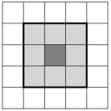
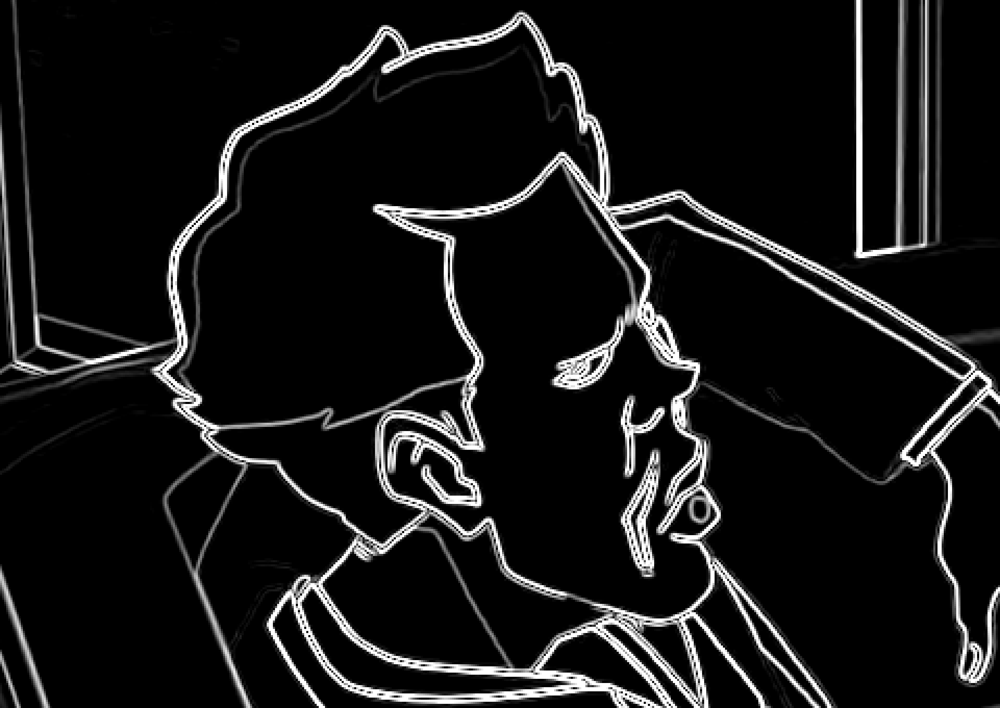
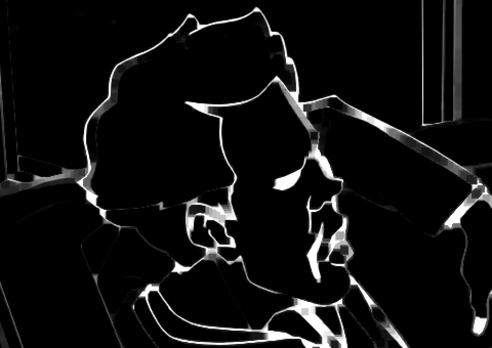
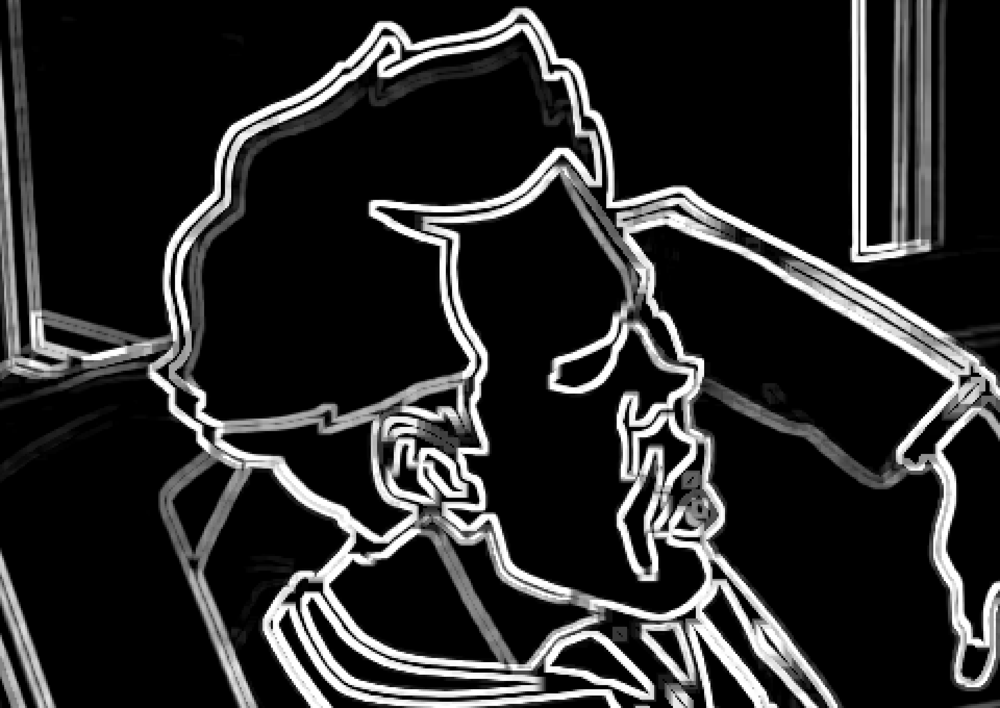

# Masking, Limiting, and Related Functions

There are filters
which change the video in various ways,
and then there are ways to change the filtering itself.
There are likely hundreds of different techniques at your disposal
for various situations,
using masks to protect details from smoothing filters,
blending two clips with different filtering applied,
and countless others—many of which haven't been thought of yet.
This article will cover:

- Masking and Merging
- Limiting
- Reference clips
- Expressions and Lookup Tables
- Runtime functions
- Pre-filtering


## Masking

Masking refers to a broad set of techniques used to merge multiple clips.
Usually one filtered clip is merged with a source clip
according to an overlay mask clip.
A mask clip specifies the weight for each individual pixel
according to which the two clips are merged;
see [MaskedMerge](#stdmaskedmerge) for details.

In practice,
masks are usually used to protect details,
texture, and/or edges
from destructive filtering effects like smoothing;
this is accomplished
by masking the areas to protect,
e.g. with an edgemask,
and merging the filtered clip with the unfiltered clip
according to the mask,
such that the masked areas are taken from the unfiltered clip,
and the unmasked areas are taken from the filtered clip.
In effect,
this applies the filtering only to the unmasked areas of the clip,
leaving the masked details/edges intact.

Mask clips are usually grayscale,
i.e. they consist of only one plane and thus contain no color information.
In VapourSynth, such clips use the color family `GRAY`
and one of these formats:
`GRAY8` (8 bits integer),
`GRAY16` (16 bits integer),
or `GRAYS` (single precision floating point).

#### [std.MaskedMerge][]

This is the main function for masking
that performs the actual merging.
It takes three clips as input:
two source clips and one mask clip.
The output will be a convex combination of the input clips,
where the weights are given by the brightness of the mask clip.
The following formula
describes these internals for each pixel:

$$
\mathrm{output} = \mathrm{clip~a} \times (\mathit{max~value} - \mathrm{mask}) + (\mathrm{clip~b} \times \mathrm{mask})
$$

where \\(\mathit{max~value}\\) is 255 for 8-bit.

In simpler terms:
for brighter areas in the mask,
the output will come from **clip b**,
and for the dark areas,
it’ll come from **clip a**.
Grey areas result in an average of **clip a** and **clip b**.

If `premultiplied` is set to True,
the equation changes as follows:

$$
\mathrm{output} = \mathrm{clip~a} \times (\mathit{max~value} - \mathrm{mask}) + \mathrm{clip~b}
$$

[std.MaskedMerge]: http://www.vapoursynth.com/doc/functions/maskedmerge.html

---


### Manipulating Masks

Building precise masks
that cover exactly what you want
is often rather tricky.
VapourSynth provides basic tools for manipulating masks
that can be used to bring them into the desired shape:

#### [std.Minimum/std.Maximum][]

The Minimum/Maximum operations replace each pixel
with the smallest/biggest value in its 3x3 neighbourhood.
The 3x3 neighbourhood of a pixel
are the 8 pixels directly adjacent to the pixel in question
plus the pixel itself.


*Illustration of the 3x3 neighborhood*

The Minimum/Maximum filters
look at the 3x3 neighbourhood of each pixel in the input image
and replace the corresponding pixel in the output image
with the brightest (Maximum) or darkest (Minimum) pixel in that neighbourhood.

Maximum generally expands/grows a mask
because all black pixels adjacent to white edges will be turned white,
whereas Minimum generally shrinks the mask
because all white pixels bordering on black ones will be turned black.

See the next section for usage examples.

Side note:
In general image processing,
these operations are known as [Erosion][] (Minimum)
and [Dilation][] (Maximum).
Maximum/Minimum actually implement only a specific case
where the [structuring element][] is a 3x3 square.
The built-in `morpho` plug-in implements the more general case
in the functions `morpho.Erode` and `morpho.Dilate`
which allow finer control over the structuring element.
However, these functions are significantly slower than
`std.Minimum` and `std.Maximum`.

[std.Minimum/std.Maximum]: http://www.vapoursynth.com/doc/functions/minimum_maximum.html
[Erosion]: https://en.wikipedia.org/wiki/Erosion_(morphology)
[Dilation]: https://en.wikipedia.org/wiki/Dilation_(morphology)
[structuring element]: https://en.wikipedia.org/wiki/Structuring_element


#### [std.Inflate/std.Deflate][]

TODO

[std.Inflate/std.Deflate]: http://www.vapoursynth.com/doc/functions/deflate_inflate.html


#### [std.Binarize][]

Split the luma/chroma values of any clip into one of two values,
according to a fixed threshold.
For instance,
binarize an edgemask to white when edge values are at or above 24,
and set values lower to 0:

```py
mask.std.Binarize(24, v0=0, v1=255)
```

For methods of creating mask clips,
there are a few general categories…

[std.Binarize]: http://www.vapoursynth.com/doc/functions/binarize.html


### Line masks

These are used for normal edge detection,
which is useful for processing edges or the area around them,
like anti-aliasing and deringing.
The traditional edge detection technique is
to apply one or more convolutions,
focused in different directions,
to create a clip containing what you might call a gradient vector map,
or more simply a clip which has brighter values in pixels
where the neighborhood dissimilarity is higher.
Some commonly used examples would be **Prewitt** (core),
**Sobel** (core),
and **kirsch** (kagefunc).

There are also some edge detection methods that use pre-filtering
when generating the mask.
The most common of these would be **TCanny**,
which applies a Gaussian blur before creating a 1-pixel-thick Sobel mask.
The most noteworthy pre-processed edge mask would be kagefunc's
**retinex\_edgemask** filter,
which at least with cartoons and anime,
is unmatched in its accuracy.
This is the mask to use if you want edge
masking with ALL of the edges and nothing BUT the edges.

Another edge mask worth mentioning is the mask in dehalohmod,
which is a black-lineart mask well-suited to dehalo masking.
Internally it uses a mask called a Camembert to generate a larger mask
and limits it to the area affected by a line-darkening script.
The main mask has no name and is simply dhhmask(mode=3).

For more information about edgemasks,
see [kageru's blog post][].

[kageru's blog post]: https://kageru.moe/blog/article/edgemasks

The **range mask**
(or in masktools,
the "min/max" mask)
also fits into this category.
It is a very simple masking method that
returns a clip made up of the maximum value of a range of neighboring pixels
minus the minimum value of the range,
as so:

```py
clipmax = core.std.Maximum(clip)
clipmin = core.std.Minimum(clip)
minmax = core.std.Expr([clipmax, clipmin], 'x y -')
```

The most common use of this mask is within GradFun3.
In theory,
the neighborhood variance technique is the perfect fit for a debanding mask.
Banding is the result of 8 bit color limits,
so we mask any pixel with a neighbor higher or lower than one 8 bit color step,
thus masking everything except potential banding.
But alas,
grain induces false positives
and legitimate details within a single color step are smoothed out,
therefore debanding will forever be a balancing act between
detail loss and residual artifacts.


#### Example: Build a simple dehalo mask

Suppose you want to remove these halos:


*Screenshot of the source.*


*Point-enlargement of the halo area.*

(Note that the images shown in your browser are likely resized poorly;
you can view them at full size in [this comparison][halo-comparison].)

Fortunately, there is a well-established script that does just that:
[DeHalo_alpha][].

However, we must be cautious in applying that filter,
since, while removing halos reliably,
it’s extremely destructive to the lineart as well.
Therefore we must use a **dehalo mask**
to protect the lineart and limit the filtering to halos.


A dehalo mask aims to cover the halos
but exclude the lines themselves,
so that the lineart won’t be blurred or dimmed.
In order to do that,
we first need to generate an edgemask.
In this example,
we’ll use the built-in Sobel function.
After generating the edge mask, we extract the luma plane:

```py
mask = core.std.Sobel(src, 0)
luma = core.std.ShufflePlanes(mask, 0, colorfamily=vs.GRAY)
```


*`luma`*

Next, we expand the mask twice, so that it covers the halos.
`vsutil.iterate` is a [function in vsutil][vsutil iterate]
which applies the specified filter a specified number of times
to a clip—in this case it runs `std.Maximum` 2 times.

```py
mask_outer = vsutil.iterate(luma, core.std.Maximum, 2)
```


*`mask_outer`*

Now we shrink the expanded clip back
to cover only the lineart.
Applying `std.Minimum` twice
would shrink it back to the edge mask’s original size,
but since the edge mask covers part of the halos too,
we need to erode it a little further.

The reason we use `mask_outer` as the basis and shrink it thrice,
instead of using `mask` and shrinking it once,
which would result in a similar outline,
is that this way,
small adjacent lines with gaps in them
(i.e. areas of fine texture or details),
such as the man’s eyes in this example,
are covered up completely,
preventing detail loss.

```py
mask_inner = vsutil.iterate(mask_outer, core.std.Minimum, 3)
```


*`mask_inner`*

Now we subtract the outer mask covering the halos
and the lineart from the inner mask covering only the lineart.
This yields a mask covering only the halos,
which is what we originally wanted:

```py
halos = core.std.Expr([mask_outer, mask_inner], 'x y -')
```


*`halos`*

Next, we do the actual dehaloing:

```py
dehalo = hf.DeHalo_alpha(src)
```


*`dehalo`*

Lastly, we use MaskedMerge to merge only the filtered halos
into the source clip,
leaving the lineart mostly untouched:

```py
masked_dehalo = core.std.MaskedMerge(src, dehalo, halos)
```


*`masked_dehalo`*

[halo-comparison]: https://slowpics.org/comparison/96cbeca4-b4be-4dfc-82b1-631bbc85cdb0
[DeHalo_alpha]: https://github.com/HomeOfVapourSynthEvolution/havsfunc/blob/8b2cd62a20faf0b410c742c95e7c7848894628d4/havsfunc.py#L370
[vsutil iterate]: https://github.com/Irrational-Encoding-Wizardry/vsutil/blob/c0206e2b68357fcbcfbcb47fafec70cce8391786/vsutil.py#L64

---


### Diff masks

A diff(erence) mask is any mask clip
generated using the variance of two clips.
There are many different ways to use this type of mask:
limiting a difference to a threshold,
processing a filtered difference itself,
or smoothing →
processing the clean clip →
overlaying the original grain.
They can also be used in conjunction with
line masks,
for example:
kagefunc's hardsubmask uses a special edge mask with a diff mask,
and uses core.misc.Hysteresis to grow the line mask into diff mask.


#### Example: Create a descale mask for white non-fading credits with extra protection for lines (16 bit input)

```py
src16 = kgf.getY(last)
src32 = fvf.Depth(src16, 32)

standard_scale = core.resize.Spline36(last, 1280, 720, format=vs.YUV444P16, resample_filter_uv='spline16')

inverse_scale = core.descale.Debicubic(src32, 1280, 720)
inverse_scale = fvf.Depth(inverse_scale, 16)

#absolute error of descaling
error = core.resize.Bicubic(inverse_scale, 1920, 1080)
error = core.std.Expr([src, error], 'x y - abs')

#create a light error mask to protect smaller spots against halos aliasing and rings
error_light = core.std.Maximum(error, coordinates=[0,1,0,1,1,0,1,0])
error_light = core.std.Expr(error_light, '65535 x 1000 / /')
error_light = core.resize.Spline36(error_light, 1280, 720)

#create large error mask for credits, limiting the area to white spots
#masks are always full-range, so manually set fulls/fulld to True or range_in/range to 1 when changing bitdepth
credits = core.std.Expr([src16, error], 'x 55800 > y 2500 > and 255 0 ?', vs.GRAY8)
credits = core.resize.Bilinear(credits, 1280, 720)
credits = core.std.Maximum(credits).std.Inflate().std.Inflate()
credits = fvf.Depth(credits, 16, range_in=1, range=1)

descale_mask = core.std.Expr([error_light, credits], 'x y -')

output = kgf.getY(standard_scale).std.MaskedMerge(inverse_scale, descale_mask)
output = muvf.MergeChroma(output, standard_scale)
```


## Single and multi-clip adjustments with std.Expr and friends

VapourSynth's core contains many such filters,
which can manipulate one to three different clips according to a math function.
Most, if not all,
can be done (though possibly slower) using std.Expr,
which will be
covered at the end of this
sub-section.


#### [std.MakeDiff][] and [std.MergeDiff][]

Subtract or add the difference of two clips, respectively.
These filters are peculiar in that they work differently in
integer and float formats,
so for more complex filtering
float is recommended whenever possible.
In 8 bit integer format where neutral luminance (gray) is 128,
the function is \\(\mathrm{clip~a} - \mathrm{clip~b} + 128\\) for MakeDiff
and \\(\mathrm{clip~a} + \mathrm{clip~b} - 128\\) for MergeDiff,
so pixels with no change will be gray.

The same is true of 16 bit and 32768.
The float version is simply \\(\mathrm{clip~a} - \mathrm{clip~b}\\) so in 32 bit
the difference is defined normally,
negative for dark differences,
positive for bright differences,
and null differences are zero.

Since overflowing values are clipped to 0 and 255,
changes greater than 128 will be clipped as well.
This can be worked around by re-defining the input clip as so:

```py
smooth = core.bilateral.Bilateral(src, sigmaS=6.4, sigmaR=0.009)
noise = core.std.MakeDiff(src, smooth) # subtract filtered clip from source leaving the filtered difference
smooth = core.std.MakeDiff(src, noise) # subtract diff clip to prevent clipping (doesn't apply to 32 bit)
```

[std.MakeDiff]: http://www.vapoursynth.com/doc/functions/makediff.html
[std.MergeDiff]: http://www.vapoursynth.com/doc/functions/mergediff.html

#### [std.Merge][]

This function is similar to [MaskedMerge](#stdmaskedmerge),
the main difference being
that a constant weight is supplied
instead of a mask clip to read the weight from for each pixel.
The formula is thus just as simple:

$$
\mathrm{output} = \mathrm{clip~a} \times (\mathit{max~value} - \mathrm{weight}) + (\mathrm{clip~b} \times \mathrm{weight})
$$

It can be used to perform
a weighted average of two clips or planes.

[std.Merge]: http://www.vapoursynth.com/doc/functions/merge.html

#### [std.Expr][]

TODO

[std.Expr]: http://www.vapoursynth.com/doc/functions/expr.html


#### [std.Lut][] and [std.Lut2][]

May be slightly faster than Expr in some cases,
otherwise they can't really do anything that Expr can't.
You can substitute a normal Python function for the RPN expression, though,
so you may still find it easier.
See link for usage information.

[std.Lut]: http://www.vapoursynth.com/doc/functions/lut.html
[std.Lut2]: http://www.vapoursynth.com/doc/functions/lut2.html


## Limiting

TODO


## Referencing

TODO


## Runtime filtering with FrameEval

TODO


#### Example: Strong smoothing on scene changes (i.e. for MPEG-2 transport streams)

```py
from functools import partial

src = core.d2v.Source()
src = ivtc(src)
src = haf.Deblock_QED(src)

ref = core.rgvs.RemoveGrain(src, 2)

# xvid analysis is better in lower resolutions
first = core.resize.Bilinear(ref, 640, 360).wwxd.WWXD()
# shift by one frame
last = core.std.DuplicateFrames(first, src.num_frames - 1).std.DeleteFrames(0)

# copy prop to last frame of previous scene
propclip = core.std.ModifyFrame(first, clips=[first, last], selector=shiftback)

def shiftback(n, f):
    both = f[0].copy()
    if f[1].props.SceneChange == 1:
        both.props.SceneChange = 1
    return both

def scsmooth(n, f, clip, ref):
    if f.props.SceneChange == 1:
        clip = core.dfttest.DFTTest(ref, tbsize=1)
    return clip

out = core.std.FrameEval(src, partial(scsmooth, clip=src, ref=ref), prop_src=propclip)
```


## Pre-filters

TODO


#### Example: Deband a grainy clip with f3kdb (16 bit input)

```py
src16 = last
src32 = fvf.Depth(last, 32)

# I really need to finish zzfunc.py :&lt;
minmax = zz.rangemask(src16, rad=1, radc=0)

#8-16 bit MakeDiff and MergeDiff are limited to 50% of full-range, so float is used here
clean = core.std.Convolution(src32, [1,2,1,2,4,2,1,2,1]).std.Convolution([1]*9, planes=[0])
grain = core.std.Expr([src32, clean32], 'x y - 0.5 +')

clean = fvf.Depth(clean, 16)
deband =core.f3kdb.Deband(clean, 16, 40, 40, 40, 0, 0, keep_tv_range=True, output_depth=16)

#limit the debanding: f3kdb becomes very strong on the smoothed clip (or rather, becomes more efficient)
#adapt strength according to a neighborhood-similarity mask, steadily decreasing strength in more detailed areas
limited = zz.AdaptiveLimitFilter(deband, clean, mask=minmax, thr1=0.3, thr2=0.0, mthr1=400, mthr2=700, thrc=0.25)

output = fvf.Depth(limited, 32).std.MergeDiff(grain)
```
