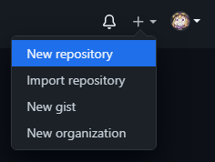
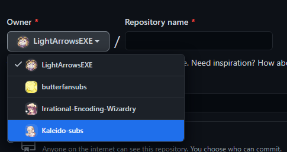
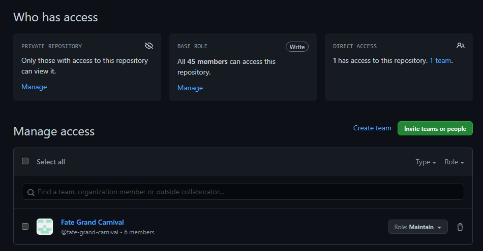
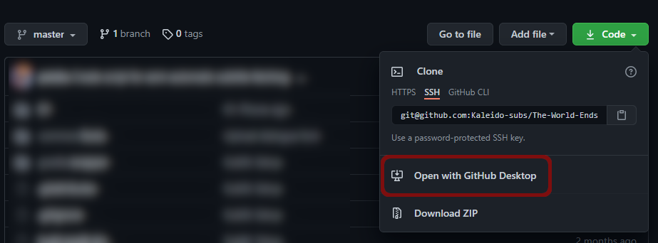
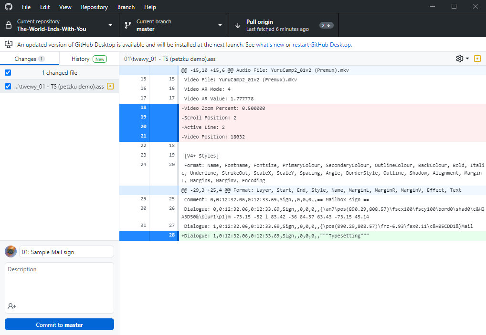
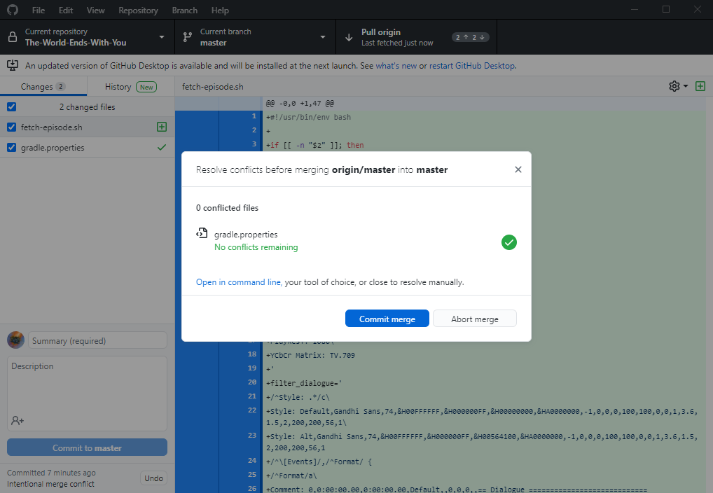

# Using GitHub for fansubbing

When working in a group,
you'll often find multiple people making changes to the same or multiple files.
The Translator will need a place to upload their translation to,
the typesetter(s) may need a place where they can upload their typesetting to,
etc.
For this kind of operation,
a Git environment may be preferable.
With Git you can very easily do version control,
which allows you to see who made changes to what files and when,
and also create an easy place to find all the relevant files and their contents
without requiring users to blindly download files to edit them
the same way they would when working in an FTP setup.

There are many benefits to using GitHub for your project,
but it may also require users to be more tech-savvy than with a regular FTP setup,
and for there to be someone to the side who can solve any problems that may arise.
Additionally,
having an FTP available may still be a good idea for your encoders,
since they will still need a place to upload bigger files to,
which GitHub is not suited for.

## Setting up a GitHub repository

If you are the project leader,
you will likely want to be the one to create a repository.
For bigger groups,
we recommend you start an organization.
This will allow you to keep better track of your ongoing projects,
as well as assign more administrators who can create and maintain repositories.
You can create a repository by pressing the + button on the top-right of the page and clicking "New repository".

You can then create a new repository under your own username or an organization you have writing access to.

Give your repository a name,
and decide to make your repo either public or private.
You may also want to add a README if you want to share additional information about the project,
like how to build it,
or links to your group's website for example.
You can then create the repository by pressing "Create repository".

If you're working with multiple users,
you'll want to make sure you to add them to the repository as well.
To do this you go to your repository's settings,
and then click on "Manage access".

Here you can manage what users (and teams in an organization) have access to your repository.
When inviting someone,
you'll want to make sure you give them the necessary permissions.
If they're a team member,
give them write access.

## Basic actions

**If you are new to GitHub,
we highly recommend you use the [GitHub desktop client][GitHub_desktop]**
(this also works with other,
similar platforms).
This guide was written under the assumption that most users will be using this client.

### Cloning

After installing the desktop client,
open it and log in.
You can then clone the repository to your system by going to `File > Clone repository`,
or by going to the repository on GitHub and going `Code > Open with GitHub Desktop`.

If the repository has not been set up yet,
you can set it up in your desktop client through the link on the repository.
This will automatically open up the cloning menu in your desktop client.

### Syncing file changes

When editing files from a git repository,
Git will remember and verify what files have been changed.
Before making any commits however,
you'll want to first double-check that you have every file pulled to your local repository.
Click "Fetch origin" at the top,
and pull in any newly-pushed commits made by other users.

Now you can verify your own changes and commit the files you want to upload/update in the repository.
The desktop client will additionally give you a very useful display of what is different between your file
and the latest version of the file you pulled in from the repo.

To make things easier for your teammates,
you'll want to make sure to give your commit a helpful title and description if necessary.
An example of a helpful commit title would be an episode number and what you did in the commit.
For example,
`03: Typeset train sign` or `08: Edited Part A`.
The description can contain more detailed information,
like what exactly was changed (if multiple things were changed),
what problems you ran across along the way,
etc.

*An example of a description that describes what changes were made in greater detail than a title would.*

Finally,
press "Commit to **master**",
and once you've finished making all your changes and committed them,
press "Push origin".

If you want to check the history to see what your teammates have changed,
you can view the history by clicking the "History" tab.
This will give you a useful oversight of all the commits,
as well as their titles/descriptions and what changes have been made to the files.

[GitHub_desktop]: https://desktop.github.com/

## Resolving merge conflicts

There are going to be times when multiple users accidentally write to the same file at the same time.
This is usually no issue,
but you may from time to time run into a merge conflict.
This means that changes made by multiple users are incompatible with one another,
and will require manual fixing.

To resolve these,
you'll want to open up the files with merge conflicts in your text editor
(do *not* use Aegisub for this).
The parts of the file with conflicts will have a `<<<<<<< HEAD` before them,
and a `>>>>>>>` at the end of them.
The differences will be separated by a `========`.
You'll want to look over the differences,
and change them however necessary for your final project.
Finally, you'll want to remove the conflict marker lines,
so all the `<<<<<<< HEAD`,
`========`,
and `>>>>>>>`'s.
Repeat this until you've dealt with every merge conflict,
and then go back to the desktop client and press "Commit merge".
Make sure you push your changes after!

## Setting up the files for your project

Now that you know how to perform the basic actions,
it is important to understand how you can best utilize GitHub.
When working in a group,
it is important you don't trip over your teammates.
To help with, it is generally recommended you split up the files as necessary
to allow people to work in parallel
without constantly having to deal with merge conflicts.

The translator,
editor,
translation checker,
and timer will generally require access to a single file,
and it's important they work sequentially;
that means they do their job one at a time in an order they agreed on.
There are tools available that help separate the timing job from that setup,
but that will be covered in a different guide.

[//]: # (Myaa's assdiff3, specifically)

The typesetters will also need to have their own files.
This separates them from the main subtitle script,
which would otherwise get massive signs added while the other members are working,
and be harder to work with for them as a result.
If there are multiple typesetters,
it's a good idea to split it up further into individual "TS files".
This allows each typesetter to do their part without interfering with the other typesetter's work.

*An example of how files are typically split.*

You can further split this however you think works best for your project.
You could for example add synced Opening/Ending subs to every directory,
or an ASS file with an insert song,
or an ASS file with all the ktemplates used in that particular episode.
Just make sure it all fits well with your group's workflow.

## Using GitHub for distribution

While it may be helpful for members to work on GitHub,
sometimes people will simply prefer other setups.
Even in those situations,
GitHub can prove useful for distribution.
It can be the place to look for the most up-to-date scripts after release for instance,
with errors that were reported post-release fixed.
This way people can always update their scripts if necessary without you needing to release a v2,
and they also have a convenient hub to report errors.

If you decide to use a GitHub repository for this,
it is recommended you create "Releases".
This way people can easily see when your project was "finalized",
and it gives a convenient way to see what commits were made after finalization.

*Here are some example fansub repositories:*

* [Kaleido-subs's repositories](https://github.com/Kaleido-subs)
* [Good Job! Media's repository](https://github.com/Fyurie/gjmbatchscripts)
