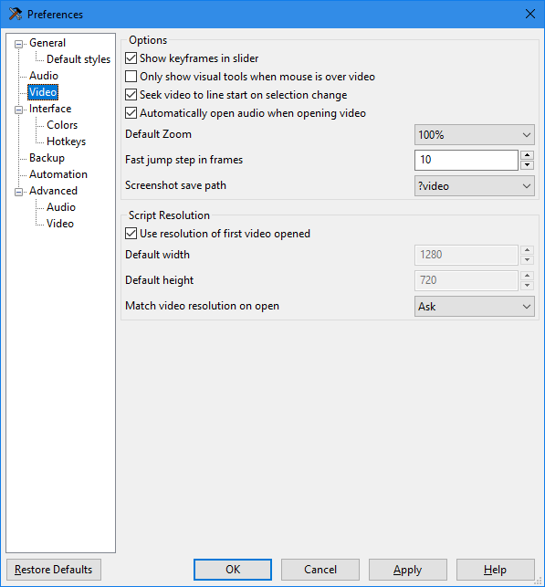
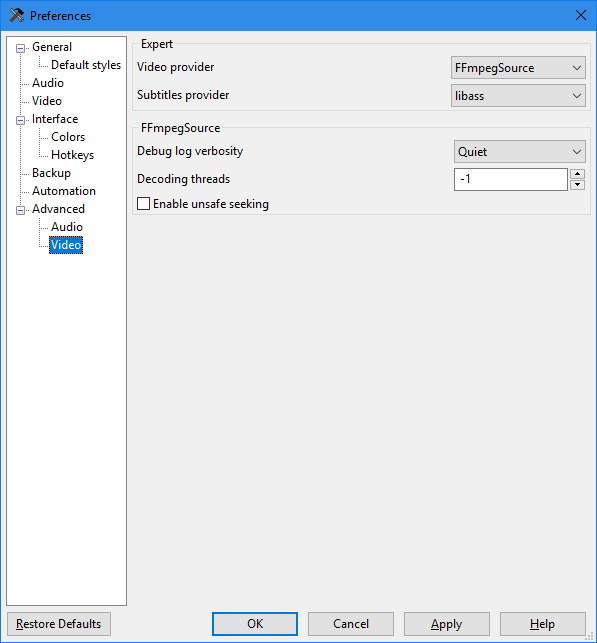
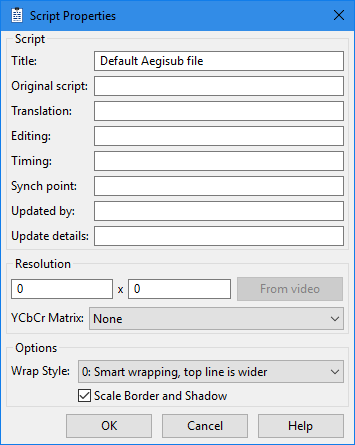

# Aegisub & Other Tools

## Tools

The first thing you'll need to do is make sure your tools are in order.
Typesetters will need more tools than most other roles in fansubbing and
they need to be configured properly.

Here is a list of tools you will want to download:

  - [Aegisub][]
      - It is **highly** recommended to use [CoffeeFlux's builds][][^1] which
        include Dependency Control and several *critical*
        fixes to Aegisub that have not been merged into the official
        application.
  - A font manager
      - Not all font managers are equal. Choose the one that works the
        best for you. Some important features might include:
          - Performance with large font libraries.
          - Add fonts from folders, not just installed fonts.
          - Activate fonts for use without installing.
          - Organize fonts in a meaningful way.
          - Works on your OS.
      - Free Options
          - [Nexusfont][]
          - [FontBase][]
      - Paid (Note: can be found free on *certain websites)*
          - [MainType][]
          - [Suitcase Fusion][]
  - Software for motion-tracking
      - [Mocha Pro standalone app][]
        - Look for it on *certain websites*.
        - On Windows, Mocha **requires** [Quicktime][] to be installed.
          More information can be found [here][quicktimeFAQ].
  - [x264 binary][][^2]
      - Download the latest binary for your platform. (`x264-r3015-4c2aafd` at the time of this edit.)
  - [Adobe Photoshop and Illustrator][]
      - Look for it on *certain websites*.
      - Alternatively, free software like
        [Gimp][] and
        [Inkscape][] may be used in some
        circumstances.

[Aegisub]: http://www.aegisub.org
[Nexusfont]: http://www.xiles.net
[FontBase]: https://fontba.se/
[MainType]: https://www.high-logic.com/font-manager/maintype
[Suitcase Fusion]: https://www.extensis.com/products/font-management/suitcase-fusion/
[Mocha Pro standalone app]: https://www.imagineersystems.com/products/mocha-pro/
[Quicktime]: https://support.apple.com/kb/DL837?locale=en_US
[quicktimeFAQ]: https://borisfx.com/faq/quicktime-on-windows/
[x264 binary]: https://artifacts.videolan.org/x264/
[Adobe Photoshop and Illustrator]: https://www.adobe.com/creativecloud.html
[Gimp]: https://www.gimp.org
[Inkscape]: https://inkscape.org/en/
[CoffeeFlux's builds]: https://thevacuumof.space/builds/

## Configuring Aegisub

NOTE: the following assumes you have installed the recommended build
mentioned above.

For now, just change your settings to reflect the following.
If you've made any changes previously for another fansub role,
be careful not to overwrite those.
When in doubt, ask someone with Aegisub experience.
Settings can be accessed via *View \> Options*
or with the hotkey *Alt + O*.

*Aegisub 8975-master-8d77da3 preferences*

Under *File \> Properties*,
there is an additional option for the *YCbCr Matrix* of the script.
This option will set the color space of the script,
and you will most likely be working with TV.709,
or BT.709.
If you are subtitling with a video present
(using *Video \> Open Video...*),
this option as well as the script resolution
will automatically be set to match the video source.

*Aegisub 8975-master-8d77da3 script properties*

For most cases with modern fansubbing,
the BT.709 color space will be used
as opposed to the legacy BT.601 color space.
If you want a more in-depth explanation of color matrices
and how these two are different,
visit [Maxime Lebled's blog](../archived-websites/bt601-vs-bt709.md),
but the gist of it is this:
BT.601 is for Standard Definition video
and BT.709 is for High Definition video[^3].

Manually setting the script to BT.601 could
**irreversibly ruin the colors of any typesetting,
dialogue,
or kfx already in the script**.
Even worse,
some video renderers will read this setting from the muxed subtitles
and render the video to match it.

If you are working on a DVD
or something in Standard Definition,
you can change this to BT.601 manually in *File \> Script Properties*.
However, not all Standard Definition video will be BT.601,
so when in doubt,
ask the encoder or check the source's
[MediaInfo][] if they are not available.

[MediaInfo]: https://mediaarea.net/en/MediaInfo

### The "Subtitles Provider"

The recommended build of Aegisub comes pre-equipped with libass,
so no manual settings change is needed.
The following is a brief history of subtitle renderers.

Just a few years ago,
there was a pretty clear consensus on which
subtitle renderer to use for anime and softsubs.
These days, not so much.
It used to be that [VSFilter][]
was the only supported renderer by most fansub groups.
VSFilter, being the first of its kind,
is considered the original subtitle renderer.
However, it was eventually replaced with [xy-VSFilter][],
and then later replaced with [xySubFilter][]
because VSFilter and xy-vsfilter were not performing as well
with the resource requirements of newer subtitles.
However, VSFilter,
and its derivatives xy-vsfilter and xySubFilter,
only support Windows operating systems.
They have often been used in codec packs[^4] for
players we don't recommend,
such as [MPC-HC][].

By 2015, however,
xySubFilter development had come to a halt and since then,
[libass][] has made many improvements
both in speed and compatibility with advanced subtitling
in part due to contributions from members of the fansub community.
At the end of the day,
which renderer you choose is up to you,
but we recommend libass.
It is maintained,
cross-platform,
able to handle most typesetting,
and has been integrated into many commercial
and open-source software products.
Libass is used in the cross-platform player
[mpv][],
that we recommend for all anime-viewing purposes.

[libass]: https://github.com/libass/libass
[VSFilter]: https://sourceforge.net/projects/guliverkli/files/VSFilter/
[xy-VSFilter]: https://forum.doom9.org/showthread.php?t=168282
[xySubFilter]: https://forum.doom9.org/showthread.php?t=168282
[MPC-HC]: https://mpc-hc.org/
[mpv]: https://mpv.io/

### Hotkeys

As you develop your skills more
and begin to integrate automation scripts into your workflow,
you will probably want to consider adding
hotkeys to cut down on time navigating menus.
These can be accessed via
*Interface \> Hotkeys*
in Aegisub's Options menu.
We'll let you decide on those yourself, however,
and move on for now.

---

[^1]: A long outstanding bug has made the recent versions of Aegisub unstable. The latest stable version as of writing this, r8903+1, can be found on [GoodJobMedia's website][].

[^2]: 32-bit builds on Windows may be more stable.

[^3]: For further reading on this, visit the Wikipedia pages for [Standard Definition][] video, [High Definition][] video, and the [BT.601][] and [BT.709][] color spaces.

[^4]: With the development of [mpv][], codec packs and player add-ons are no longer required.

[Standard Definition]: https://en.wikipedia.org/wiki/Standard-definition_television
[High Definition]: https://en.wikipedia.org/wiki/High-definition_video
[BT.601]: https://en.wikipedia.org/wiki/Rec._601
[BT.709]: https://en.wikipedia.org/wiki/Rec._709
[GoodJobMedia's website]: https://www.goodjobmedia.com/fansubbing/
